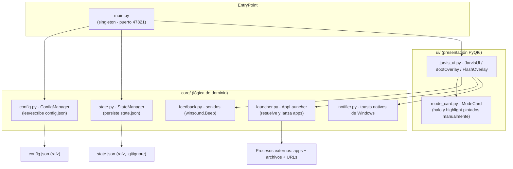
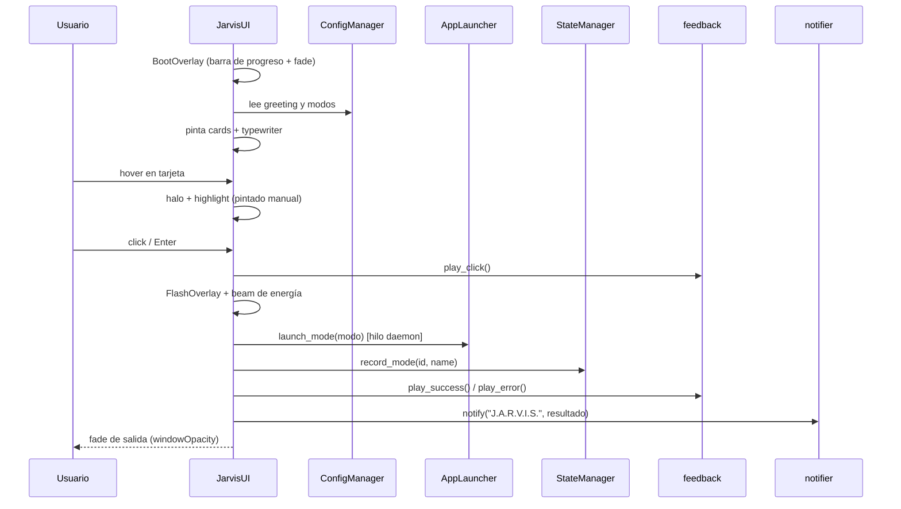

# Arquitectura - J.A.R.V.I.S. Launcher

> Estado: estable · Versión de referencia: 1.3.0 · Actualizado: 2026-09-10 (America/Bogota)

## 1. Descripción general

**J.A.R.V.I.S. Launcher** es una aplicación de escritorio para Windows (Python 3 +
PyQt6) que agrupa aplicaciones por modos de operación (Gaming, Trabajo, Estudio)
con estética arcade/cyberpunk. Cada modo lanza las apps configuradas y ofrece
retroalimentación audiovisual (sonidos sintetizados y animaciones propias).

## 2. Diagrama de componentes

## 3. Módulos y responsabilidades

### `main.py`
- **Entry point** de la aplicación.
- Garantiza instancia única mediante un socket local en el puerto `47821`
  (si el puerto está ocupado, notifica y sale).
- Crea `ConfigManager`, `AppLauncher` y `JarvisUI`, y ejecuta el bucle de eventos.

### `core/config.py` — `ConfigManager`
- Carga/valida `config.json`; si no existe, lo crea con `DEFAULT_CONFIG`.
- `DEFAULT_CONFIG` define 3 modos: `gaming`, `work`, `study`
  (con `name`, `icon`, `color`, `description` y `apps`).
- Accessors tipados: `app_name`, `greeting`, `modes`, `get_mode(mode_id)`,
  `get_mode_ids()`, `get_mode_apps(mode_id)`, `get_mode_color(mode_id)`
  (fallback cian `#00FFFF`), `update_mode_apps(mode_id, apps)`.
- `save()` persiste con `indent=4` y `ensure_ascii=False` (UTF-8).

### `core/state.py` — `StateManager`
- Persiste `state.json` en la raíz del proyecto (excluido de git vía `.gitignore`).
- `MAX_HISTORY = 5` entradas de historial.
- `record_mode(mode_id, mode_name)`: registra `last_mode` + `history`
  (evita duplicados consecutivos) con timestamp ISO local.
- `get_last_mode()`, `get_history()`.

### `core/launcher.py` — `AppLauncher`
- Lanza una lista de apps resolviendo cada entry por **nombre corto**:
  1. Ruta directa existente en disco (`launch_command`).
  2. `shutil.which(nombre)` (PATH del sistema).
  3. Accesso directo (`.lnk`) del Menú Inicio vía PowerShell COM.
  4. Registro de Windows `App Paths` (HKCU/HKLM).
- Soporta archivos (`os.startfile`), ejecutables (con comillas SAFE si la ruta
  tiene espacios) y URLs (prefijo `http://` / `https://`).
- Ejecuta los lanzamientos en un **hilo daemon** para no bloquear la UI.
- Registro de actividad por consola (`[launcher]`).
- Ver también: [ADR-002](./ADR-002-resolucion-apps-por-nombre.md).

### `core/feedback.py` — sonidos
- Sistema de `winsound.Beep` en hilos daemon (no depende del esquema de sonidos
  de Windows; arregla los `SND_ALIAS` que fallaban).
- Señales: click (1250 Hz, 60 ms), éxito (987 + 1319 Hz), error (220 Hz, 260 ms).
- No bloquea el hilo de la UI.

### `core/notifier.py`
- Toast nativo de Windows vía `Windows.UI.Notifications` (PowerShell + COM).
- `notify(title, message)`: solo en `win32`; fallback silencioso si falla.

### `ui/jarvis_ui.py`
- `JarvisUI` (QWidget a pantalla completa, frameless):
  - Fondo obsidiana + partículas + núcleo vibrante.
  - Saludo con efecto máquina de escribir (typewriter).
  - Beam de energía del núcleo hacia la tarjeta seleccionada.
  - Selección con teclado (flechas + Enter) y ratón.
  - Fade de entrada/salida con `windowOpacity` (nativa, no `QGraphicsOpacityEffect`).
- `BootOverlay` / `FlashOverlay`: overlays con propiedades `fade` / `alpha`
  animadas vía `QPropertyAnimation`; pintura manual en `paintEvent`.
- Ver también: [ADR-001](./ADR-001-quitar-qgraphicseffect.md).

### `ui/mode_card.py` — `ModeCard`
- Tarjeta de modo con borde neon (color del modo), icono, nombre y descripción.
- Estados **normal / hover / seleccionada**:
  - Hover: halo brillante alrededor de la tarjeta (pintado manualmente).
  - Seleccionada: highlight de relleno + brackets de esquina (HUD).
- El resplandor difuso se difumina con un degradado radial propio (con
  `QRadialGradient`), **sin** `QGraphicsDropShadowEffect` (arregla tarjetas
  negras y spam de QPainter).
- Ver también: [ADR-001](./ADR-001-quitar-qgraphicseffect.md).

## 4. Flujo de información (ciclo principal)

## 5. Operaciones

| Operación | Comando |
|-----------|---------|
| Ejecutar la app (consola) | `python main.py` (o `pythonw main.py` sin consola) |
| Ejecutar la app (global) | `jarvis` en CMD/PowerShell (ver [ADR-003](./ADR-003-comando-global-jarvis.md)) |
| Instalar comando global | `install_jarvis_cmd.bat` (copia `jarvis.cmd` a `%USERPROFILE%\bin` y agrega al PATH de usuario) |
| Desinstalar comando global | `install_jarvis_cmd.bat --uninstall` |
| Auto-inicio con Windows | `install_startup.bat` (usa `assets/startup.vbs`, invisible) |
| Resolver comandos de consola | nunca: la app es de escritorio |

**Requiere:** Python 3.10+, PyQt6 (`requirements.txt`).

## 6. Seguridad y operación

- El socket singleton usa el puerto local `47821`; no expone servicios de red.
- Los lanzamientos externos respetan las rutas del sistema operativo; el
  usuario es responsable de las apps configuradas en `config.json`.
- `state.json` es estado local de usuario y **no se versiona** (`.gitignore`).

## 7. Trabajo pendiente y deuda técnica (TODO)

Fuente viva de pendientes: [`TODO.md` raíz](../TODO.md).

Resumen de categorías vigentes (verificado al 2026-09-10):

- **Ventana**: prueba de pantalla completa real; posición secundaria de la
  ventana en monitores múltiples.
- **Retroalimentación**: variar velocidad del typewriter; sonido más suave al hacer
  hover; fallback escaneo de apps por instalación estándar (Steam/Epic).
- **Rendimiento**: revisar el uso de CPU del core/beam en pantallas grandes.
- **Pruebas**: verificación de toasts de Windows 10/11; prueba en máquina
  limpia (sin PySide6) del flujo de instalación.

> Nota: este listado es deuda técnica conocida; no implica compromisos de
> calendario. Cada item pendiente puede convertirse en tarea con commit/PR.