# Arquitectura - J.A.R.V.I.S. Launcher

> Estado: estable · Versión de referencia: 2.0.0 · Actualizado: 2026-09-11 (America/Bogota)

## 1. Descripción general

**J.A.R.V.I.S. Launcher** es una aplicación de escritorio para Windows (Python 3 +
PyQt6) que agrupa aplicaciones por modos de operación (Gaming, Trabajo, Estudio)
con estética estilo JARVIS. Cada modo lanza las apps configuradas y ofrece
retroalimentación audiovisual (sonidos sintetizados y animaciones propias).
Incluye panel lateral de noticias RSS (presets o URL propia), temas de color
seleccionables desde la interfaz y panel de control (rueda ⚙).

Desde la v2.0.0 (modo workspace / foco) incorpora además:
- **Comportamiento de ventana**: el launcher queda SIEMPRE al frente y se oculta
  al elegir un modo; se invoca desde el atajo global `Ctrl+Shift+Espacio`
  (`core/hotkey.py`) o desde la bandeja del sistema (`core/tray.py`); el ✕ oculta
  a la bandeja en lugar de cerrar.
- **Saludo dinámico**: por franja horaria + adjetivo profesional rotativo
  (`core/greeting.py`), sustituido por el **nombre real** cuando la cuenta de
  GitHub está vinculada (`core/github_link.py`).
- **Tarjetas "modo workspace"**: monograma tipográfico en lugar del icono emoji
  flotante; los modos Gaming/Trabajo/Estudio se conservan.
- **Panel de noticias limpio** con la cabecera "¿Qué está pasando en el mundo
  ahora?" y jerarquía tipográfica (fuente/hora + título + preview).
- **Panel de control estructurado** en lista (Apariencia / Comportamiento /
  Noticias / Cuenta de GitHub / Próximamente).

## 2. Diagrama de componentes

```mermaid
flowchart TD
    subgraph EntryPoint
        main["main.py<br/>(singleton - puerto 47821)"]
    end

    subgraph Core["core/ (lógica de dominio)"]
        cfg["config.py - ConfigManager<br/>(lee/escribe config.json - modos/apps)"]
        set["settings.py - SettingsManager<br/>(lee/escribe settings.json - preferencias UI)"]
        thm["themes.py - ThemeManager/Theme<br/>(paleta y temas)"]
        nws["news.py - NewsService<br/>(RSS/Atom con stdlib)"]
        hk["hotkey.py - GlobalHotkey<br/>(atajo global Ctrl+Shift+Espacio)"]
        tr["tray.py - Tray<br/>(bandeja del sistema)"]
        gr["greeting.py - saludo dinámico<br/>(franja horaria + adjetivo)"]
        gl["github_link.py - vinculación GitHub<br/>(gh autenticado / API pública)"]
        st["state.py - StateManager<br/>(persiste state.json)"]
        ln["launcher.py - AppLauncher<br/>(resuelve y lanza apps)"]
        fb["feedback.py - sonidos (winsound.Beep)"]
        nt["notifier.py - toasts nativos de Windows"]
    end

    subgraph UI["ui/ (presentación PyQt6)"]
        ui_main["jarvis_ui.py - JarvisUI / BootOverlay / FlashOverlay"]
        cards["mode_card.py - ModeCard<br/>(paint 100% custom, monograma)"]
        np["news_panel.py - NewsPanel / NewsItemWidget / EmptyNewsView"]
        rd["news_reader.py - NewsReaderView / MiniNewsItem<br/>(lector fullscreen - split-pane)"]
        sd["settings_dialog.py - SettingsDialog / ConnectDialog / GithubDialog"]
    end

    main --> cfg
    main --> set
    main --> st
    main --> ui_main

    ui_main --> cards
    ui_main --> np
    ui_main --> sd
    ui_main --> rd
    ui_main --> fb
    ui_main --> ln
    ui_main --> nt
    ui_main --> hk
    ui_main --> tr
    ui_main --> gr
    ui_main --> gl

    np -. "readerRequested(items, index)" .-> rd

    cfg -.-> config_json["config.json (raíz)"]
    set -.-> settings_json["settings.json (raíz, .gitignore)"]
    st -.-> state_json["state.json (raíz, .gitignore)"]
    ln --> proc["Procesos externos: apps + archivos + URLs"]
    nws -.-> feeds["Feeds RSS/Atom externos (https)"]
    gl -.-> gh_api["api.github.com/users/{username} (https)"]
    tr -.-> tray_icon["QSystemTrayIcon (bandeja Windows)"]
```



## 3. Módulos y responsabilidades

### `main.py`
- **Entry point** de la aplicación.
- Garantiza instancia única mediante un socket local en el puerto `47821`
  (si el puerto está ocupado, notifica y sale).
- Crea `ConfigManager`, `SettingsManager`, `AppLauncher` y `JarvisUI`, inyecta
  `settings` a la UI y ejecuta el bucle de eventos.

### `core/settings.py` — `SettingsManager`
- Persiste las **preferencias de interfaz** del usuario en `settings.json`
  (raíz, excluido de git vía `.gitignore`).
- Claves: `theme` (id del tema), `news.enabled`, `news.position`
  (`left`/`right`), `news.width`, `news.sources` (lista `{name, url}`),
  `tray.enabled` (bandeja activa), `github.{username,name}` (cuenta vinculada
  para el saludo con nombre real) y `greeting.adjective_index` (adjetivo
  rotativo persistido entre arranques).
- Migración suave de claves antiguas y de nuevas claves al leer; `save()` con
  `indent=4` UTF-8.
- Ver también: [ADR-004](./ADR-004-temas-thememanager.md).

### `core/hotkey.py` — `GlobalHotkey`
- Atajo global **`Ctrl+Shift+Espacio`** para mostrar/ocultar el launcher desde
  cualquier aplicación, sin dependencias nuevas.
- Implementación: `RegisterHotKey` (API nativa de Windows vía `ctypes`,
  `HWND=0` + `WM_HOTKEY`) + `QAbstractNativeEventFilter` para recibir el
  mensaje `0x0312` y emitir la señal propia `activated` en el hilo de la UI.
- Degradación silenciosa: si el atajo ya está registrado por otro proceso, se
  loguea advertencia y la app sigue funcionando (bandeja/etiqueta).

### `core/tray.py` — `Tray`
- Bandeja del sistema (`QSystemTrayIcon`) con **icono generado por código**
  (`QPainter`, sin assets externos) que se recoleorea con el acento del tema
  activo (`set_accent`).
- Menú contextual: **Mostrar** (invoca el launcher) y **Salir** (salida real);
  doble clic en el icono también invoca el launcher.
- `show_message(title, body)`: notificación del icono de bandeja (usada para
  indicar el atajo global al ocultar el launcher).

### `core/greeting.py` — saludo dinámico
- `greeting_for(now, display_name)` → texto de saludo según franja horaria:
  - `05:00–12:00` → "Buenos días"
  - `12:00–19:00` → "Buenas tardes"
  - resto → "Buenas noches"
- `ADJECTIVES`: lista de adjetivos profesionales (Desarrollador, Ingeniero,
  Arquitecto, Creador, Hacker, Explorador, Maestro, Visionario, Estratega,
  Artesano). El índice rota en cada arranque y se persiste en
  `greeting.adjective_index`.
- `display_name`: nombre real tomado de la cuenta GitHub vinculada (si existe)
  o el adjetivo rotativo.

### `core/github_link.py` — vinculación de GitHub
- **Detección automática**: `detect_gh_identity()` ejecuta `gh api user --jq
  .login` y `.name // empty`; si el CLI `gh` está autenticado, devuelve
  `(username, name)`. Sin secretos: solo se persisten `username` y `name`.
- **Verificación manual**: `verify_username(username)` consulta
  `GET https://api.github.com/users/{username}` con `urllib.request` (timeout
  acotado); devuelve `(username, name)` o `None` si no existe.
- La UI (`GithubDialog`) usa la detección en un hilo daemon y entrega el
  resultado con señal Qt; el launcher detecta la cuenta automáticamente al
  arrancar si aún no está vinculada.

### `core/themes.py` — `ThemeManager` / `Theme`
- `Theme` (dataclass frozen): paleta completa (bg, bg_alt, text, text_dim,
  accent, accent_soft, card_border, grid, scan, ring_outer/mid/inner) + flags
  `is_dark`, `is_obsidian`.
- `ThemeManager`: resuelve por id, lista de temas disponibles y helper
  estático `rgba(color, alpha)` → `QColor` (evita constructores inválidos
  `QColor("#hex", n)` de Qt6).
- 8 temas: obsidiana (clásico), nocturno, crimson, esmeralda, matriz,
  violeta, ámbar, luz, nieve.
- Ver también: [ADR-004](./ADR-004-temas-thememanager.md).

### `core/news.py` — `NewsService`
- Descarga feeds RSS 2.0 / Atom con `urllib.request` y parsea con
  `xml.etree.ElementTree` (**solo stdlib, sin dependencias nuevas**).
- `NewsItem`: título, enlace, fuente, fecha (`datetime` aware UTC) y
  `time_ago()` para la UI.
- `PRESET_SOURCES`: 10 fuentes predefinidas; soporta URL propia (validación
  con lectura real del feed).
- Ver también: [ADR-005](./ADR-005-panel-noticias-rss.md).

### `core/config.py` — `ConfigManager`
- Carga/valida `config.json`; si no existe, lo crea con `DEFAULT_CONFIG`.
- `DEFAULT_CONFIG` define 3 modos: `gaming`, `work`, `study`
  (con `name`, `icon`, `color`, `description` y `apps`).
- Accessors tipados: `app_name`, `greeting`, `modes`, `get_mode(mode_id)`,
  `get_mode_ids()`, `get_mode_apps(mode_id)`, `get_mode_color(mode_id)`
  (fallback cian `#00FFFF`), `update_mode_apps(mode_id, apps)`.
- `save()` persiste con `indent=4` y `ensure_ascii=False` (UTF-8).

### `core/state.py` — `StateManager`
- Persiste `state.json` en la raíz del proyecto (excluido de git vía `.gitignore`).
- `MAX_HISTORY = 5` entradas de historial.
- `record_mode(mode_id, mode_name)`: registra `last_mode` + `history`
  (evita duplicados consecutivos) con timestamp ISO local.
- `get_last_mode()`, `get_history()`.

### `core/launcher.py` — `AppLauncher`
- Lanza una lista de apps resolviendo cada entry por **nombre corto**:
  1. Ruta directa existente en disco (`launch_command`).
  2. `shutil.which(nombre)` (PATH del sistema).
  3. Accesso directo (`.lnk`) del Menú Inicio vía PowerShell COM.
  4. Registro de Windows `App Paths` (HKCU/HKLM).
- Soporta archivos (`os.startfile`), ejecutables (con comillas SAFE si la ruta
  tiene espacios) y URLs (prefijo `http://` / `https://`).
- Ejecuta los lanzamientos en un **hilo daemon** para no bloquear la UI.
- Registro de actividad por consola (`[launcher]`).
- Ver también: [ADR-002](./ADR-002-resolucion-apps-por-nombre.md).

### `core/feedback.py` — sonidos
- Sistema de `winsound.Beep` en hilos daemon (no depende del esquema de sonidos
  de Windows; arregla los `SND_ALIAS` que fallaban).
- Señales: click (1250 Hz, 60 ms), éxito (987 + 1319 Hz), error (220 Hz, 260 ms).
- No bloquea el hilo de la UI.

### `core/notifier.py`
- Toast nativo de Windows vía `Windows.UI.Notifications` (PowerShell + COM).
- `notify(title, message)`: solo en `win32`; fallback silencioso si falla.

### `ui/jarvis_ui.py`
- `JarvisUI` (QWidget a pantalla completa, frameless):
  - Layout compacto: barra superior (logo, ruedita ⚙, auto-inicio, cerrar),
    título, tarjetas centradas, barra de estado y **panel de noticias lateral**.
  - Temas consumidos vía `ThemeManager`; `apply_theme()` re-pinta fondos
    (grid, partículas, anillos HUD, scan, beam, vignette) y estilos QSS y
    actualiza el acento del icono de bandeja.
  - Saludo con efecto máquina de escribir (typewriter) construido con
    `_build_greeting()` (hora + adjetivo/nombre real) y `refresh_greeting()`
    público para re-render al vincular la cuenta GitHub.
  - **Comportamiento v2**: `show_and_raise()` (z-order + foco), ocultación
    automática al elegir un modo (`QTimer.singleShot(700, self.hide)` para
    dejar al frente las apps lanzadas), `closeEvent` que oculta a la bandeja
    (con notificación del atajo global) y solo cierra de verdad con
    `quit_app()`/`_force_quit`; `toggle_visibility()` para el atajo global.
  - Beam de energía del núcleo hacia la tarjeta seleccionada.
  - Selección con teclado (flechas + Enter) y ratón.
  - `open_settings()` abre el panel de control (rueda ⚙).
  - Fade de entrada/salida con `windowOpacity` (nativa, no `QGraphicsOpacityEffect`).
- `BootOverlay` / `FlashOverlay`: overlays con propiedades `fade` / `alpha`
  animadas vía `QPropertyAnimation`; pintura manual en `paintEvent`.
- Ver también: [ADR-001](./ADR-001-quitar-qgraphicseffect.md),
  [ADR-004](./ADR-004-temas-thememanager.md),
  [ADR-006](./ADR-006-atajo-global-bandeja.md).

### `ui/mode_card.py` — `ModeCard`
- Tarjeta de modo con **pintura 100% custom** en `paintEvent` (sin QLabels).
- Estados **normal / hover / seleccionada**:
  - Hover: halo brillante alrededor de la tarjeta (pintado manualmente) +
    zoom sutil (1.02) del contenido.
  - Seleccionada: barra de acento superior estilo IDE + contador de apps en
    Consolas.
- **Estética workspace v2**: monograma tipográfico (inicial del modo) en
  contenedor sobrio, paleta del tema y jerarquía abajo/arriba; se eliminó el
  icono emoji flotante y los corner brackets; los modos Gaming/Trabajo/Estudio
  se conservan.
- **Entrada escalonada**: `play_entrance(delay)` anima altura + fade de cada
  tarjeta con `QPropertyAnimation`.
- Sin `QGraphicsDropShadowEffect` (arregla tarjetas negras y spam de QPainter).
- Ver también: [ADR-001](./ADR-001-quitar-qgraphicseffect.md).

### `ui/news_panel.py` — `NewsPanel`
- `NewsPanel` (QFrame) lateral: posición (izq/der según `settings`), ancho
  280–560 px redimensionable **arrastrando el borde interior** (handle 10 px).
- Descarga en hilo daemon → entrega al hilo UI vía señal `_itemsFetched`
  (nunca se tocan widgets desde el hilo de trabajo).
- Refresh automático cada 10 min + botón manual; timer y estados visibles.
- **Anti-saturación**: cada `NewsItemWidget` muestra fuente + hora en dim y
  título destacado (2 líneas) — **sin preview apilado**; tarjeta de 88 px,
  spacing 10 y lista limitada a 12 noticias. El resumen y el contenido real
  viven en el lector (`NewsReaderView`).
- **Clic emite `readerRequested(items, index)`** para abrir el lector con el
  mini navegador (`NewsReaderView`).
- `EmptyNewsView`: estado vacío sobrio ("◉") con botón CONFIG (emite
  `configureRequested` → abre `ConnectDialog`).
- Ver también: [ADR-005](./ADR-005-panel-noticias-rss.md),
  [ADR-007](./ADR-007-lector-noticias.md),
  [ADR-008](./ADR-008-webengine.md).

### `ui/news_reader.py` — `NewsReaderView` / `MiniBrowser`
- **Lector de noticias a pantalla completa** (spec v2 pts. 3-4), hijo overlay
  de `JarvisUI` (mismo patrón que `BootOverlay`): `setGeometry(parent.rect())`
  + `raise_()`; fade de entrada con `windowOpacity` (ADR-001).
- **Split-pane redimensionable** (`QSplitter` horizontal, handle estilizado
  del tema): lista compacta izquierda (`MiniNewsItem`, 180–380 px) + **mini
  navegador embebido** a la derecha.
- **Mini navegador (`MiniBrowser`)** — decisión del ADR-008: `QStackedWidget`
  con `QWebEngineView` (Chromium, PyQt6-WebEngine) **o** `QTextBrowser`
  (fallback con el resumen del feed). `show_article(item, html)` carga la
  **URL real del artículo** (imágenes, CSS y contenido completo) en Chromium;
  sin la dependencia, muestra el HTML de lectura larga v2 (lead con capitular,
  pull-quote). El módulo se importa en el constructor (try/except, lazy).
- Encabezado: **← VOLVER**, fuente·hora (con estado "Cargando artículo…"),
  **⟳** recargar y **ABRIR ORIGINAL ↗** (`webbrowser.open`).
- Navegación `←`/`→` y `Escape` (señal `closeRequested`); clic en la lista
  también navega; HTML de respaldo generado con los colores del tema
  (`set_theme`).
- `main.py` activa `AA_ShareOpenGLContexts` antes de crear `QApplication`
  (requisito del WebEngine).
- Ver también: [ADR-007](./ADR-007-lector-noticias.md),
  [ADR-008](./ADR-008-webengine.md).

### `ui/settings_dialog.py` — `SettingsDialog` / `ConnectDialog` / `GithubDialog`
- `SettingsDialog` (modal, rueda ⚙): **lista estructurada v2** con filas
  etiqueta-izquierda/control-derecha y separadores:
  1. **Apariencia**: selector de tema con swatches.
  2. **Comportamiento**: bandeja del sistema (checkbox), auto-inicio
     (toggle funcional vía `toggle_startup()`).
  3. **Noticias**: activar/desactivar, posición (izquierda/derecha) y fuente.
  4. **Cuenta de GitHub**: fila que abre `GithubDialog` y muestra la cuenta
     vinculada (fallback: manual).
  5. **Próximamente**: filas informativas de funciones en desarrollo.
  - Botones APLICAR / CANCELAR; `apply_theme`/bandeja/noticias se sincronizan
    con el padre al confirmar.
- `GithubDialog` (modal): detecta automáticamente la cuenta con `gh` en hilo
  daemon (señal `identityDetected`) o permite vincular manualmente un username
  verificado contra la API pública (`verify_username`); guarda
  `github.{username,name}` y refresca el saludo.
- `ConnectDialog` (modal): presets `PRESET_SOURCES` en scroll + campo de URL
  RSS/Atom personalizada con **validación en hilo daemon**; el resultado
  vuelve al hilo principal por la señal `validationDone(bool, str)` (no usa
  `QMetaObject.invokeMethod` con kwargs, inválido en PyQt6).
- Ver también: [ADR-005](./ADR-005-panel-noticias-rss.md),
  [ADR-006](./ADR-006-atajo-global-bandeja.md).

## 4. Flujo de información (ciclo principal)

```mermaid
sequenceDiagram
    participant U as Usuario
    participant W as JarvisUI
    participant C as ConfigManager
    participant S as SettingsManager
    participant N as NewsPanel
    participant R as NewsReaderView
    participant L as AppLauncher
    participant ST as StateManager
    participant F as feedback
    participant NT as notifier
    participant H as GlobalHotkey
    participant TR as Tray
    participant G as github_link

    W->>W: BootOverlay (barra de progreso + fade)
    W->>C: lee greeting y modos
    W->>S: lee tema, posición/ancho del panel, bandeja, GitHub
    W->>G: detect_gh_identity() (hilo daemon) si no vinculada
    G-->>W: (username, name) → refresh_greeting()
    W->>W: pinta cards + typewriter (tema activo)
    W->>N: refresh (hilo daemon, señal _itemsFetched)
    N-->>W: items (del hilo de trabajo al hilo UI)
    U->>N: click en una noticia
    N-->>W: readerRequested(items, index)
    W->>R: _open_reader(items, index) → show + fade (fullscreen)
    R-->>U: lectura larga (lead/pull-quote/cuerpo)
    U->>R: ← / → cambian articulo; clic en lista
    U->>R: Escape → closeRequested
    R-->>W: _close_reader() → hide, vuelve al launcher
    U->>W: hover en tarjeta
    W->>W: halo + zoom (pintado manual)
    U->>W: click / Enter
    W->>F: play_click()
    W->>W: FlashOverlay + beam de energía
    W->>H: hide() tras 700 ms (deja al frente las apps)
    W->>L: launch_mode(modo) [hilo daemon]
    W->>ST: record_mode(id, name)
    W->>NT: notify("J.A.R.V.I.S.", resultado)
    U->>H: Ctrl+Shift+Espacio (cualquier app)
    H-->>W: signal activated → toggle_visibility()
    U->>TR: clic/doble clic en icono de bandeja
    TR-->>W: show_and_raise()
```

## 5. Operaciones

| Operación | Comando |
|-----------|---------|
| Ejecutar la app (consola) | `python main.py` (o `pythonw main.py` sin consola) |
| Ejecutar la app (global) | `jarvis` en CMD/PowerShell (ver [ADR-003](./ADR-003-comando-global-jarvis.md)) |
| Instalar comando global | `install_jarvis_cmd.bat` (copia `jarvis.cmd` a `%USERPROFILE%\bin` y agrega al PATH de usuario) |
| Desinstalar comando global | `install_jarvis_cmd.bat --uninstall` |
| Auto-inicio con Windows | `install_startup.bat` (usa `assets/startup.vbs`, invisible) |
| Resolver comandos de consola | nunca: la app es de escritorio |

**Requiere:** Python 3.10+, PyQt6 (`requirements.txt`).

## 6. Seguridad y operación

- El socket singleton usa el puerto local `47821`; no expone servicios de red.
- Las fuentes RSS se descargan por HTTPS con timeout acotado; la URL
  personalizada se valida leyendo el feed real (sin ejecutar código externo).
- Los lanzamientos externos respetan las rutas del sistema operativo; el
  usuario es responsable de las apps configuradas en `config.json`.
- `state.json` y `settings.json` son estado/preferencias locales y **no se
  versionan** (`.gitignore`).

## 7. Trabajo pendiente y deuda técnica (TODO)

Fuente viva de pendientes: [`TODO.md` raíz](../TODO.md).

Resumen de categorías vigentes (verificado al 2026-09-11):

- **Ventana**: el atajo global y la bandeja están implementados y probados en
  offscreen; falta validación interactiva en Windows real (mensaje `WM_HOTKEY`
  y notificaciones de bandeja). Probar sin conflictos con otro proceso usando
  `Ctrl+Shift+Espacio` (el registro fallido se loguea como advertencia).
- **Lector de noticias v2** (spec puntos 3 y 4): implementado con **mini
  navegador embebido** (`PyQt6-WebEngine`, o fallback texto) y panel
  des saturado; validación visual de la navegación real (`setUrl` → contenido
  cargado) en pantalla de escritorio pendiente.
- **Dependencias**: `PyQt6-WebEngine` agregado como opcional (ADR-008); en
  entornos sin GPU Chromium cae a software (warnings). 
- **Temas**: soporte de tema claro con contraste verificado en todo el paint
  custom; editor visual de paletas.
- **Noticias**: soporte JSON Feed; caché offline de items; filtro por
  categoría/idioma.
- **Panel de control**: editor gráfico de modos (agregar/quitar apps desde la
  UI) integrado con la rueda ⚙.
- **Rendimiento**: revisar el uso de CPU del core/beam en pantallas grandes.
- **Pruebas**: verificación de toasts de Windows 10/11; prueba en máquina
  limpia (sin PySide6) del flujo de instalación.

> Nota: este listado es deuda técnica conocida; no implica compromisos de
> calendario. Cada item pendiente puede convertirse en tarea con commit/PR.