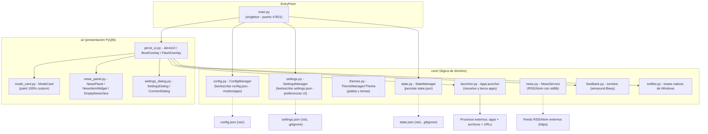
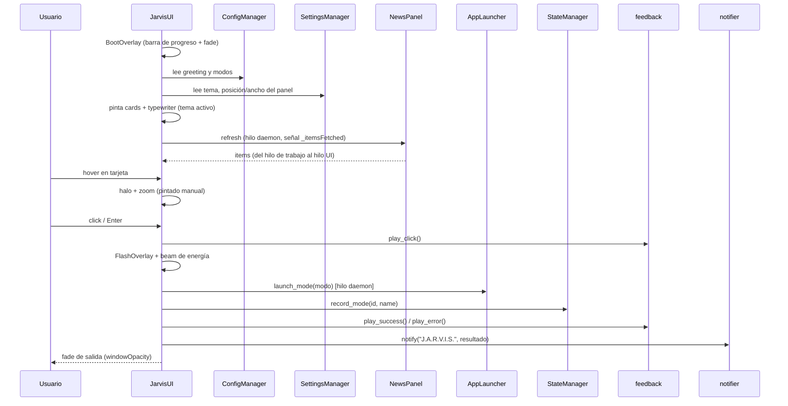

# Arquitectura - J.A.R.V.I.S. Launcher

> Estado: estable · Versión de referencia: 1.4.0 · Actualizado: 2026-09-10 (America/Bogota)

## 1. Descripción general

**J.A.R.V.I.S. Launcher** es una aplicación de escritorio para Windows (Python 3 +
PyQt6) que agrupa aplicaciones por modos de operación (Gaming, Trabajo, Estudio)
con estética arcade/cyberpunk. Cada modo lanza las apps configuradas y ofrece
retroalimentación audiovisual (sonidos sintetizados y animaciones propias).
Incluye panel lateral de noticias RSS (presets o URL propia), temas de color
seleccionables desde la interfaz y panel de control (rueda ⚙).

## 2. Diagrama de componentes

## 3. Módulos y responsabilidades

### `main.py`
- **Entry point** de la aplicación.
- Garantiza instancia única mediante un socket local en el puerto `47821`
  (si el puerto está ocupado, notifica y sale).
- Crea `ConfigManager`, `SettingsManager`, `AppLauncher` y `JarvisUI`, inyecta
  `settings` a la UI y ejecuta el bucle de eventos.

### `core/settings.py` — `SettingsManager`
- Persiste las **preferencias de interfaz** del usuario en `settings.json`
  (raíz, excluido de git vía `.gitignore`).
- Claves: `theme` (id del tema), `news.enabled`, `news.position`
  (`left`/`right`), `news.width`, `news.sources` (lista `{name, url}`).
- Migración de claves antiguas al leer; `save()` con `indent=4` UTF-8.
- Ver también: [ADR-004](./ADR-004-temas-thememanager.md).

### `core/themes.py` — `ThemeManager` / `Theme`
- `Theme` (dataclass frozen): paleta completa (bg, bg_alt, text, text_dim,
  accent, accent_soft, card_border, grid, scan, ring_outer/mid/inner) + flags
  `is_dark`, `is_obsidian`.
- `ThemeManager`: resuelve por id, lista de temas disponibles y helper
  estático `rgba(color, alpha)` → `QColor` (evita constructores inválidos
  `QColor("#hex", n)` de Qt6).
- 8 temas: obsidiana (clásico), nocturno, crimson, esmeralda, matriz,
  violeta, ámbar, luz, nieve.
- Ver también: [ADR-004](./ADR-004-temas-thememanager.md).

### `core/news.py` — `NewsService`
- Descarga feeds RSS 2.0 / Atom con `urllib.request` y parsea con
  `xml.etree.ElementTree` (**solo stdlib, sin dependencias nuevas**).
- `NewsItem`: título, enlace, fuente, fecha (`datetime` aware UTC) y
  `time_ago()` para la UI.
- `PRESET_SOURCES`: 10 fuentes predefinidas; soporta URL propia (validación
  con lectura real del feed).
- Ver también: [ADR-005](./ADR-005-panel-noticias-rss.md).

### `core/config.py` — `ConfigManager`
- Carga/valida `config.json`; si no existe, lo crea con `DEFAULT_CONFIG`.
- `DEFAULT_CONFIG` define 3 modos: `gaming`, `work`, `study`
  (con `name`, `icon`, `color`, `description` y `apps`).
- Accessors tipados: `app_name`, `greeting`, `modes`, `get_mode(mode_id)`,
  `get_mode_ids()`, `get_mode_apps(mode_id)`, `get_mode_color(mode_id)`
  (fallback cian `#00FFFF`), `update_mode_apps(mode_id, apps)`.
- `save()` persiste con `indent=4` y `ensure_ascii=False` (UTF-8).

### `core/state.py` — `StateManager`
- Persiste `state.json` en la raíz del proyecto (excluido de git vía `.gitignore`).
- `MAX_HISTORY = 5` entradas de historial.
- `record_mode(mode_id, mode_name)`: registra `last_mode` + `history`
  (evita duplicados consecutivos) con timestamp ISO local.
- `get_last_mode()`, `get_history()`.

### `core/launcher.py` — `AppLauncher`
- Lanza una lista de apps resolviendo cada entry por **nombre corto**:
  1. Ruta directa existente en disco (`launch_command`).
  2. `shutil.which(nombre)` (PATH del sistema).
  3. Accesso directo (`.lnk`) del Menú Inicio vía PowerShell COM.
  4. Registro de Windows `App Paths` (HKCU/HKLM).
- Soporta archivos (`os.startfile`), ejecutables (con comillas SAFE si la ruta
  tiene espacios) y URLs (prefijo `http://` / `https://`).
- Ejecuta los lanzamientos en un **hilo daemon** para no bloquear la UI.
- Registro de actividad por consola (`[launcher]`).
- Ver también: [ADR-002](./ADR-002-resolucion-apps-por-nombre.md).

### `core/feedback.py` — sonidos
- Sistema de `winsound.Beep` en hilos daemon (no depende del esquema de sonidos
  de Windows; arregla los `SND_ALIAS` que fallaban).
- Señales: click (1250 Hz, 60 ms), éxito (987 + 1319 Hz), error (220 Hz, 260 ms).
- No bloquea el hilo de la UI.

### `core/notifier.py`
- Toast nativo de Windows vía `Windows.UI.Notifications` (PowerShell + COM).
- `notify(title, message)`: solo en `win32`; fallback silencioso si falla.

### `ui/jarvis_ui.py`
- `JarvisUI` (QWidget a pantalla completa, frameless):
  - Layout compacto: barra superior (logo, ruedita ⚙, auto-inicio, cerrar),
    título, tarjetas centradas, barra de estado y **panel de noticias lateral**.
  - Temas consumidos vía `ThemeManager`; `apply_theme()` re-pinta fondos
    (grid, partículas, anillos HUD, scan, beam, vignette) y estilos QSS.
  - Saludo con efecto máquina de escribir (typewriter).
  - Beam de energía del núcleo hacia la tarjeta seleccionada.
  - Selección con teclado (flechas + Enter) y ratón.
  - `open_settings()` abre el panel de control (rueda ⚙).
  - Fade de entrada/salida con `windowOpacity` (nativa, no `QGraphicsOpacityEffect`).
- `BootOverlay` / `FlashOverlay`: overlays con propiedades `fade` / `alpha`
  animadas vía `QPropertyAnimation`; pintura manual en `paintEvent`.
- Ver también: [ADR-001](./ADR-001-quitar-qgraphicseffect.md),
  [ADR-004](./ADR-004-temas-thememanager.md).

### `ui/mode_card.py` — `ModeCard`
- Tarjeta de modo con **pintura 100% custom** en `paintEvent` (sin QLabels).
- Estados **normal / hover / seleccionada**:
  - Hover: halo brillante alrededor de la tarjeta (pintado manualmente) +
    zoom sutil (~1.045) del contenido.
  - Seleccionada: sweep beam + corner brackets (HUD) + contador de apps.
- **Icono flotante**: posición del icono animada con QTimer (~30 fps) para el
  efecto "hovering" sin gastar CPU en repintados continuos de la tarjeta.
- **Entrada escalonada**: `play_entrance(delay)` anima altura + fade de cada
  tarjeta con `QPropertyAnimation`.
- Sin `QGraphicsDropShadowEffect` (arregla tarjetas negras y spam de QPainter).
- Ver también: [ADR-001](./ADR-001-quitar-qgraphicseffect.md).

### `ui/news_panel.py` — `NewsPanel`
- `NewsPanel` (QFrame) lateral: posición (izq/der según `settings`), ancho
  280–560 px redimensionable **arrastrando el borde interior** (handle 10 px).
- Descarga en hilo daemon → entrega al hilo UI vía señal `_itemsFetched`
  (nunca se tocan widgets desde el hilo de trabajo).
- Refresh automático cada 10 min + botón manual; timer y estados visibles.
- `NewsItemWidget`: animación de entrada (crece altura + fade, insert arriba
  → el resto baja), hover resaltado, **clic abre la noticia** en el navegador.
- `EmptyNewsView`: estado desconectado con botón CONECTAR (emite
  `configureRequested` → abre `ConnectDialog`).
- Ver también: [ADR-005](./ADR-005-panel-noticias-rss.md).

### `ui/settings_dialog.py` — `SettingsDialog` / `ConnectDialog`
- `SettingsDialog` (modal, rueda ⚙): selector de tema con **swatches**,
  activar/desactivar panel de noticias, posición (izquierda/derecha), botones
  APLICAR / CANCELAR.
- `ConnectDialog` (modal): presets `PRESET_SOURCES` en scroll + campo de URL
  RSS/Atom personalizada con **validación en hilo daemon**; el resultado
  vuelve al hilo principal por la señal `validationDone(bool, str)` (no usa
  `QMetaObject.invokeMethod` con kwargs, inválido en PyQt6).
- Ver también: [ADR-005](./ADR-005-panel-noticias-rss.md).

## 4. Flujo de información (ciclo principal)

## 5. Operaciones

| Operación | Comando |
|-----------|---------|
| Ejecutar la app (consola) | `python main.py` (o `pythonw main.py` sin consola) |
| Ejecutar la app (global) | `jarvis` en CMD/PowerShell (ver [ADR-003](./ADR-003-comando-global-jarvis.md)) |
| Instalar comando global | `install_jarvis_cmd.bat` (copia `jarvis.cmd` a `%USERPROFILE%\bin` y agrega al PATH de usuario) |
| Desinstalar comando global | `install_jarvis_cmd.bat --uninstall` |
| Auto-inicio con Windows | `install_startup.bat` (usa `assets/startup.vbs`, invisible) |
| Resolver comandos de consola | nunca: la app es de escritorio |

**Requiere:** Python 3.10+, PyQt6 (`requirements.txt`).

## 6. Seguridad y operación

- El socket singleton usa el puerto local `47821`; no expone servicios de red.
- Las fuentes RSS se descargan por HTTPS con timeout acotado; la URL
  personalizada se valida leyendo el feed real (sin ejecutar código externo).
- Los lanzamientos externos respetan las rutas del sistema operativo; el
  usuario es responsable de las apps configuradas en `config.json`.
- `state.json` y `settings.json` son estado/preferencias locales y **no se
  versionan** (`.gitignore`).

## 7. Trabajo pendiente y deuda técnica (TODO)

Fuente viva de pendientes: [`TODO.md` raíz](../TODO.md).

Resumen de categorías vigentes (verificado al 2026-09-10):

- **Temas**: soporte de tema claro con contraste verificado en todo el paint
  custom; editor visual de paletas.
- **Noticias**: soporte JSON Feed; caché offline de items; filtro por
  categoría/idioma.
- **Panel de control**: editor gráfico de modos (agregar/quitar apps desde la
  UI) integrado con la rueda ⚙.
- **Ventana**: prueba de pantalla completa real; posición secundaria de la
  ventana en monitores múltiples.
- **Rendimiento**: revisar el uso de CPU del core/beam en pantallas grandes.
- **Pruebas**: verificación de toasts de Windows 10/11; prueba en máquina
  limpia (sin PySide6) del flujo de instalación.

> Nota: este listado es deuda técnica conocida; no implica compromisos de
> calendario. Cada item pendiente puede convertirse en tarea con commit/PR.